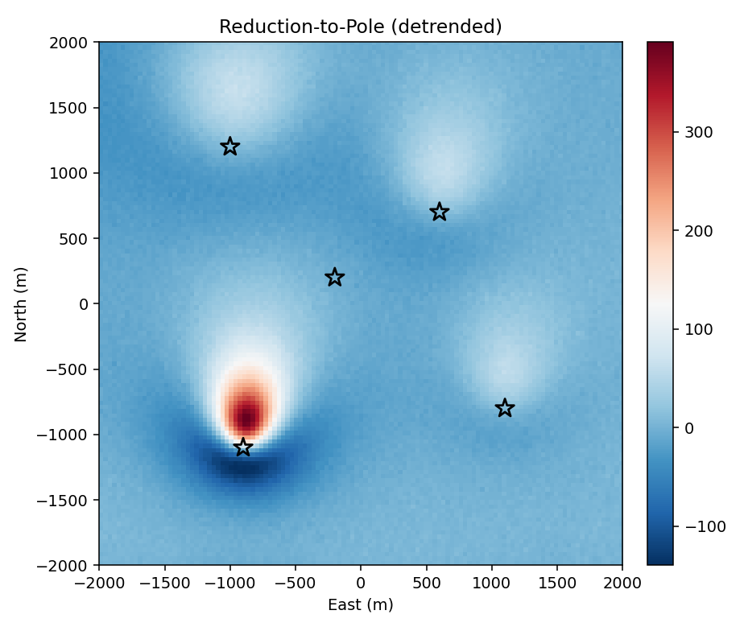
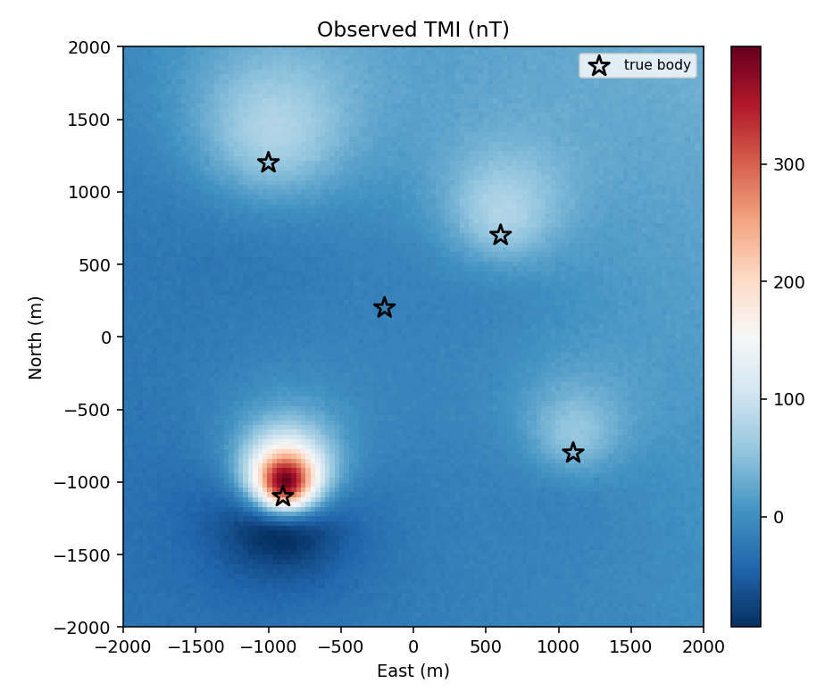
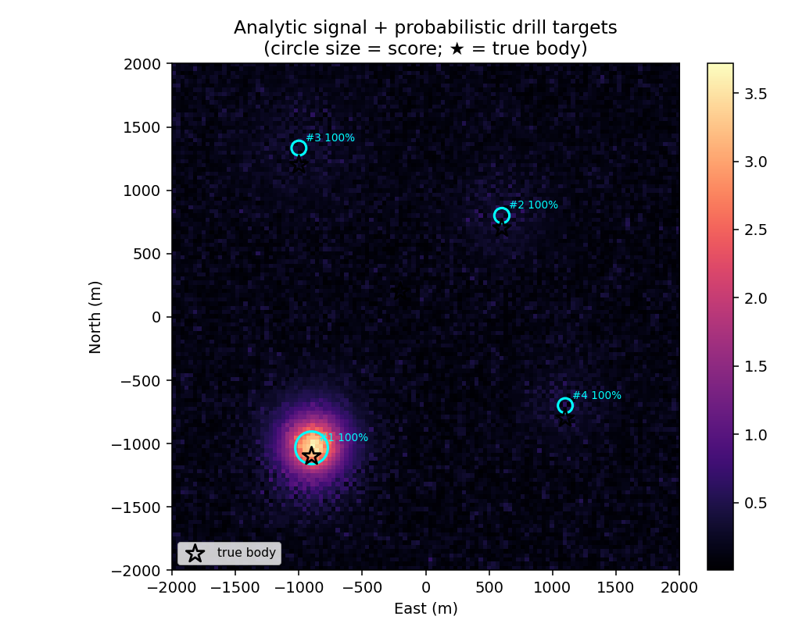
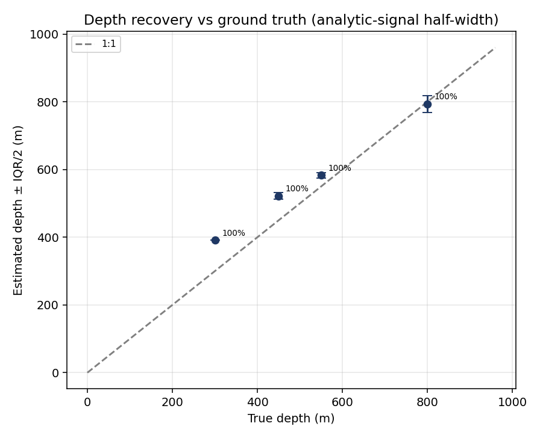

# Subsurface drill-target ranking — probabilistic, uncertainty-aware

[](https://github.com/Pr0spektor/subsurface-target-ranking/actions/workflows/ci.yml)
[](LICENSE)

A reference implementation of the core exploration-analytics workflow behind AI-native subsurface
platforms: transforming potential-field (magnetic) data into a prioritised set of drill targets,
each with an estimated source depth and a quantified detection confidence.

The pipeline is reproducible and validated end to end. A physics-based magnetic forward model
provides known ground truth, against which recovered target locations and depths are scored; the
same processing and ranking code then applies directly to real aeromagnetic surveys
(`src/real_data.py`).




## Validation against ground truth
The committed example is driven by a physics-based magnetic forward model (dipole response of buried
magnetised bodies, plus a regional field and observational noise). Modelling the observed response
is itself a core exploration task, and because the true source locations and depths are known, it
allows the method to be scored quantitatively — something field data alone cannot provide.

## Result (synthetic survey, known ground truth)



- **4 / 5 bodies recovered** at **100% detection probability**; the 5th is a weak, deep decoy
  correctly rejected (a true negative — honest behaviour, not cherry-picking).
- **Mean horizontal error ≈ 100 m** (≈3 grid cells); **mean depth error ≈ 51 m**.



## Method (all from first principles, NumPy)
1. **Forward model** — TMI over dipole sources in a chosen field (`src/forward_model.py`).
2. **Processing** (`src/processing.py`, FFT-domain): polynomial regional removal, reduction-to-pole,
   vertical derivatives, upward continuation, analytic signal, tilt angle.
3. **Detection** — local maxima of the (denoised) analytic signal with non-max suppression + border
   masking; reduction-independent, so peaks sit over sources.
4. **Depth** — analytic-signal **half-width** estimator (robust for compact sources), with a single
   constant calibrated on the forward model (depth ≈ 1.75 × half-width); recovers source depth to a
   mean error of ≈50 m across the test targets (see depth-recovery figure).
5. **Probabilistic ranking** (`src/targeting.py`) — Monte-Carlo over noise realisations yields, per
   target, a **detection probability**, a **depth median + interquartile spread**, and a score.
6. **Validation** (`src/pipeline.py`) — matches ranked targets to known truth and reports recovery.

## Run
```bash
pip install -r requirements.txt
python -m src.pipeline          # synthetic demo -> results/ figures + CSVs
pytest -q                        # test suite (physics + recovery)
```

### On real data
`src/real_data.py` loads a **real open aeromagnetic survey** (Great Britain, BGS, via `ensaio`),
projects and grids it with `verde`; the same `targeting.monte_carlo_rank(...)` then runs unchanged.
Needs a scientific-Python env with internet:
```bash
pip install ensaio verde pyproj pooch
python -c "from src import real_data, targeting as tg; g=real_data.load_britain_magnetic(); \
           t,_=tg.monte_carlo_rank(g['tmi'],g['dx'],g['E'],g['N'],g['cfg'],n_runs=60); print(t[:5])"
```

## Tests & CI
`pytest -q` runs a suite covering the forward-model localisation, reduction-to-pole identity at the
pole, the FFT vertical derivative, monotonicity of the depth estimator, and end-to-end truth
recovery. GitHub Actions runs the tests and the full pipeline on every push
(`.github/workflows/ci.yml`).

## Layout
```
subsurface-target-ranking/
├── src/
│   ├── forward_model.py   # physics-based synthetic magnetic survey
│   ├── processing.py      # FFT potential-field operators (RTP, derivatives, analytic signal…)
│   ├── targeting.py       # detection, depth (half-width + Euler), probabilistic MC ranking
│   ├── pipeline.py        # end-to-end run + ground-truth validation + figures
│   └── real_data.py       # real aeromagnetic survey loader (ensaio + verde, Great Britain/BGS)
├── tests/                 # pytest suite (physics + recovery)
├── .github/workflows/     # CI (tests + pipeline on every push)
├── results/               # generated figures + ranked_targets.csv + recovery.csv
├── requirements.txt · CITATION.cff · LICENSE
```

## Scope & assumptions
- The committed example is driven by a forward model (real physics, synthetic geology) so results
  can be validated against ground truth; `src/real_data.py` applies the identical pipeline to real
  open aeromagnetic data.
- Depth is estimated from the analytic-signal half-width, with a constant calibrated on the forward
  model; an Euler-deconvolution implementation is included for comparison.
- A production system would extend this with 3-D inversion (SimPEG), multi-method fusion
  (gravity/EM) and geological priors; the code is structured to accommodate them.

Designed to demonstrate applied-geophysics and scientific-programming judgement: transparent,
first-principles methods, uncertainty quantification, and quantitative validation against ground
truth.
